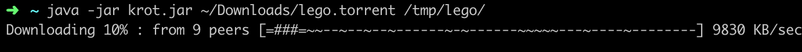

# Command Line Torrent Client
Command line torrent client written in kotlin using coroutines.

## Usage
`java -jar  krot.jar ~/Downloads/lego.torrent /tmp/lego/`

First argument is torrent file, second - destination folder.

